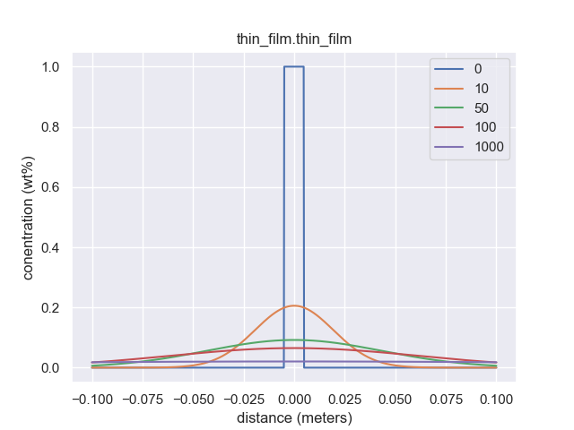
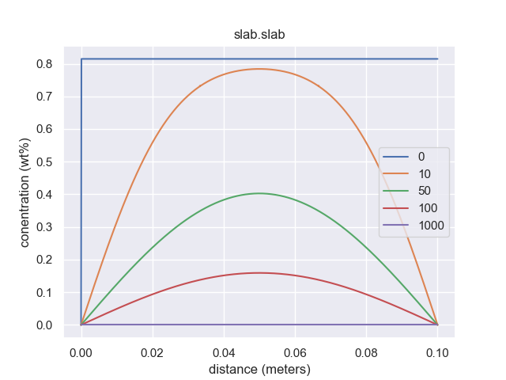
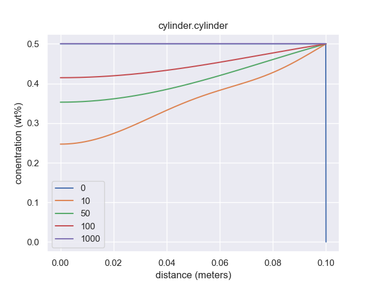
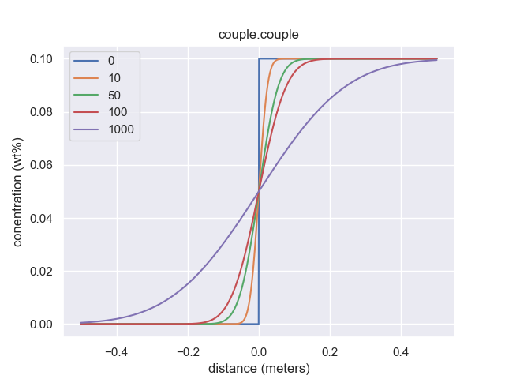

# fick1d


This package is for simulating non-steady state diffusion according to Fick's Second law of diffusion in 1 dimension.

## Installation

```
pip install fick1d
```

## Current 1-D models supported:

 - Slab
 - Cylinder
 - Sphere
 - Diffusion Couple
 - Thin Film


## Example Usage

```python
import fick1d
import matplotlib.pyplot as plt

times = [100,200,300]               # 100,200,300 seconds after diffusion starts
slab_thickness = .1                 # .1 meters thick slab
diffusivity = 1.88e-5               # diffusivity of material to be simulated in m^2/s
interface_concentration = .5        # concenttration at interface for slab in m^2/s
initial_concentration = 0           # initial concenttration for slab in m^2/s

results = fick1d.slab.slab( times,
                            slab_thickness, 
                            diffusivity, 
                            interface_concentration, 
                            initial_concentraton)

for i in range(len(times)):
    plt.title(fun)
    plt.plot(linspace(0,slab_thickness,1000),results[i],label = str(times[i]))
plt.legend()
plt.show()
```

## Fick's second law

This is the general pde that governs diffusion in solids. 

<a href="https://www.codecogs.com/eqnedit.php?latex=\frac{\partial&space;C}{\partial&space;t}=D\frac{\partial^2&space;C}{\partial&space;x^2}" target="_blank"></a>

### Thin Film Solution:

<a href="https://www.codecogs.com/eqnedit.php?latex=\large&space;c(x,t)=\frac{N}{\sqrt{4\pi&space;Dt}&space;}&space;exp({\frac{-x^2}{4Dt}})" target="_blank"></a>



### Slab Solution

<a href="https://www.codecogs.com/eqnedit.php?latex=\large&space;\frac{c(x,t)-c_i}{c_f-c_i}=1-\frac{4}{\pi}&space;\sum_{n=0}^{&space;\infty}exp\left&space;(&space;-Dt(\frac{(2n&plus;1)\pi}{h})^2&space;\right&space;)\left&space;(&space;\frac{sin((2n&plus;1)\pi&space;x/h)}{2n&plus;1}&space;\right&space;)" target="_blank"></a>



### Sphere Solution

Assuming only radial diffusion,

<a href="https://www.codecogs.com/eqnedit.php?latex=\frac{C(t,x)&space;-&space;C_1}{C_0-C_1}=1&plus;\frac{2a}{\pi&space;r}\sum_{\infty}^{n=1}\frac{(-1)^n}{n}sin\left&space;(&space;\frac{n&space;\pi&space;r}{a}&space;\right&space;)exp\left&space;(&space;-Dn^2&space;\pi^2&space;t&space;/a^2\right&space;)" target="_blank"></a>

With the limit as r -> 0 i.e. the concentration at the center of the sphere

<a href="https://www.codecogs.com/eqnedit.php?latex=\frac{C(t,x)-C_1}{C_0-C_1}=1&plus;2\sum_{n=1}^{\infty}(-1)^nexp(-Dn^2\pi^2&space;t/a^2)" target="_blank"></a>


### Cylinder Solution

Assuming only radial diffusion,

<a href="https://www.codecogs.com/eqnedit.php?latex=\frac{C(t,x)-C_1}{C_0-C_1}=1-\frac{2}{a}\sum_{n=1}^{\infty}\frac{exp(-D&space;\alpha_n^2&space;t)J_0(r&space;\alpha_n)}{\alpha_n&space;J_1(a&space;\alpha_n)}" target="_blank"></a>



### Diffusion Couple Solution

<a href="https://www.codecogs.com/eqnedit.php?latex=\frac{C(t,x)-C_0}{C_0-C_b}=1-erf(\frac{x}{2&space;\sqrt{Dt}&space;})" target="_blank"></a>



## Contributing
Pull requests are welcome. For major changes, please open an issue first to discuss what you would like to change.

## Author

Kieran Nehil [github](https://github.com/kierannp)

## Source for Math:

http://www-eng.lbl.gov/~shuman/NEXT/MATERIALS&COMPONENTS/Xe_damage/Crank-The-Mathematics-of-Diffusion.pdf
